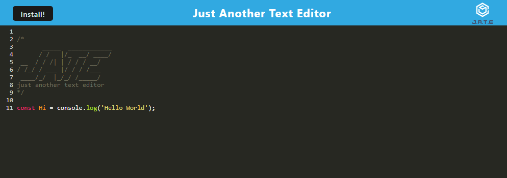

# JATE 

## Table of Content
* [Description](#description)
* [Instructions](#instructions)
* [Visuals](#visuals)
* [Links](#links)
* [Support](#support)


## Description
A text editor that is also a PWA. This allows it to be downloaded and saved off the web. The text editor saves any text you've added and even includes syntax highlighting in different colors. Previosly saved text can also be reacged even while offline. 

## Instructions
By running ```npm install``` in the terminal all the required npm dependencies will be installed. Then start the server with ```npm run start:dev``` in the terminal.

## Visuals


## Links
GitHub: https://github.com/SupernalDeity/jate
Heroku: 

## Suppport
Send support ticket to perezant121@gmail.com.
